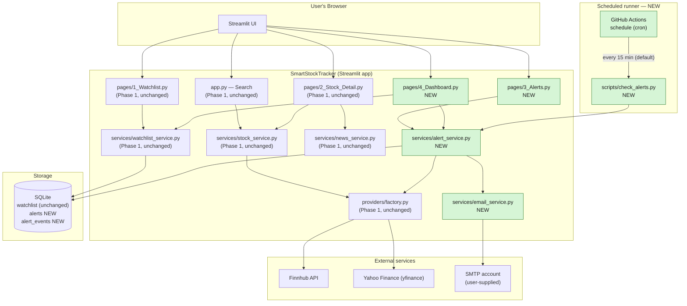
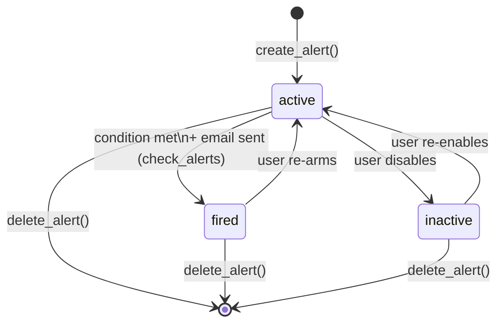
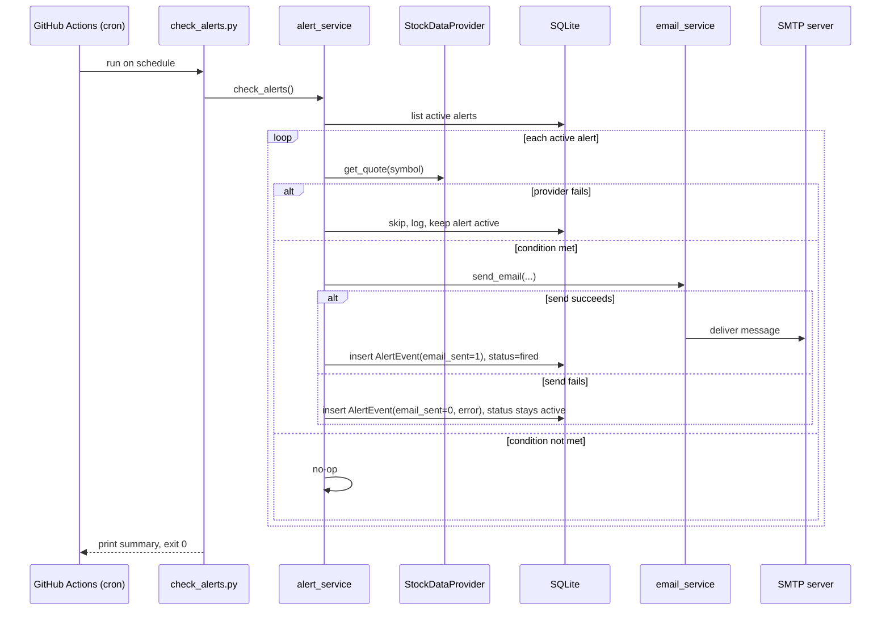

# Architecture: Notifications & Dashboard (Phase 2)

Mermaid diagrams for this feature. Phase 1 components are shown unchanged;
Phase 2 additions are marked `NEW`.

## System architecture

## Alert lifecycle (state machine)

## Scheduled check sequence

